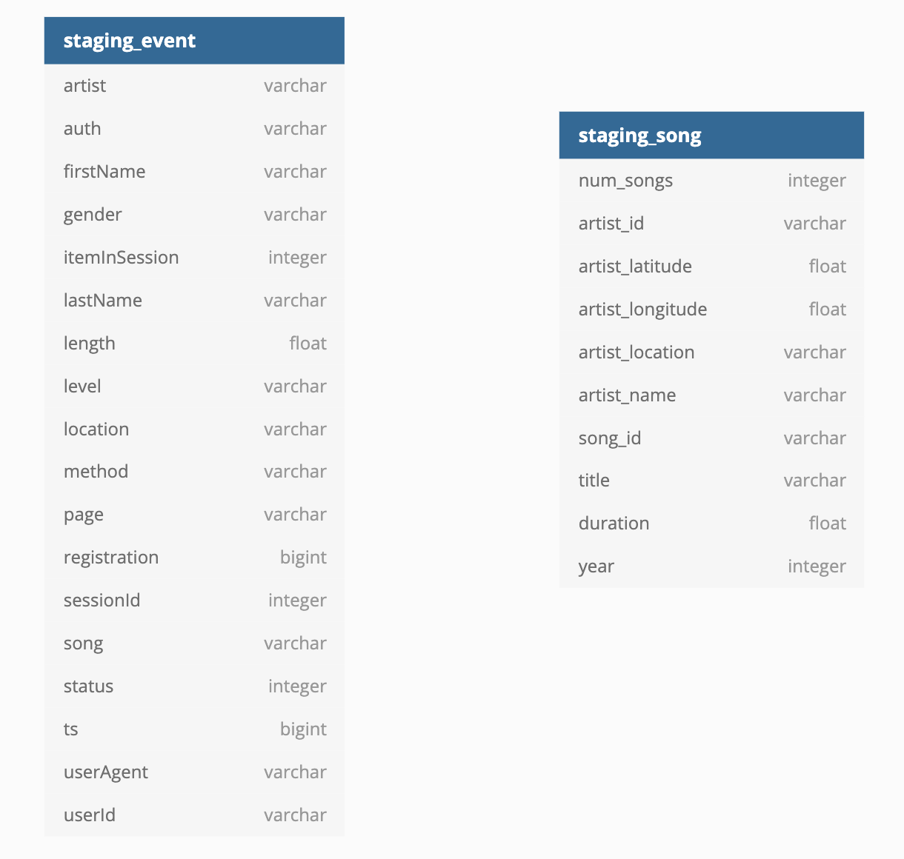
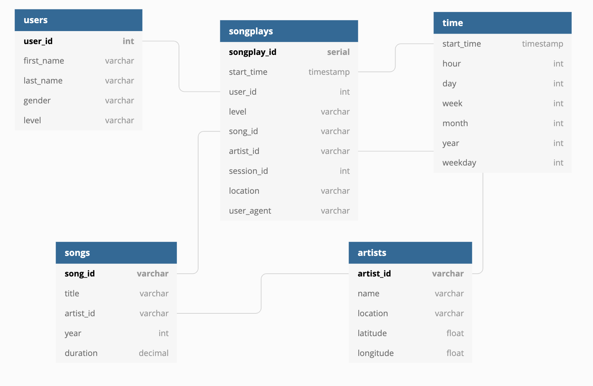

# Sparkify Data Warehouse

Sparkify is a music-streaming app. They have user event data and song data in JSON files in an S3 Bucket.
They want to know what songs their users are listening to. This project takes their data and moves it into
a Redshift cluster in order to extract the data and organize it around song plays.

### Table structure

#### Staging tables

#### Data analysis tables

### Files in project

* create_tables.py
  * Drops tables if they exist
  * Creates staging tables
  * Creates data analysis tables
* dwh.cfg
  * Configuration file with data warehouse and s3 bucket values
  * Some of these fields need to be updated by user
* etl.py
  * Pipeline for extracting data from S3 buckets to Redshift cluster
* manage_cluster.ipynb
  * Jupyter notebook for creating and tearing down a cluster and role programatically.
* sql_queries.py
  * Contains the queries for dropping tables, creating tables, copying data from JSON to staging tables,
    and inserting data into the data analysis tables.

### How to execute the project

* Update the dwh.cfg file
  * Update KEY with your AWS Access Key
  * Update SECRET with your AWS Secret Key
* Create a Redshift cluster and an S3 Readonly Access role by executing all cells in Step 1 of manage_cluster.ipynb
* When the cluster becomes available, execute Step 2 of manage_cluster.ipynb and update dwh.cfg with the HOST and ARN
* Run `$ python create_tables.py` to drop any existing tables and recreate them on the cluster.
* Run `$ python etl.py` to execute the ETL pipeline.
* Run your queries on the tables via the Redshift Query Editor.
* When you're finished, close the cluster and delete the role by running Step 3 from manage_cluster.ipynb
